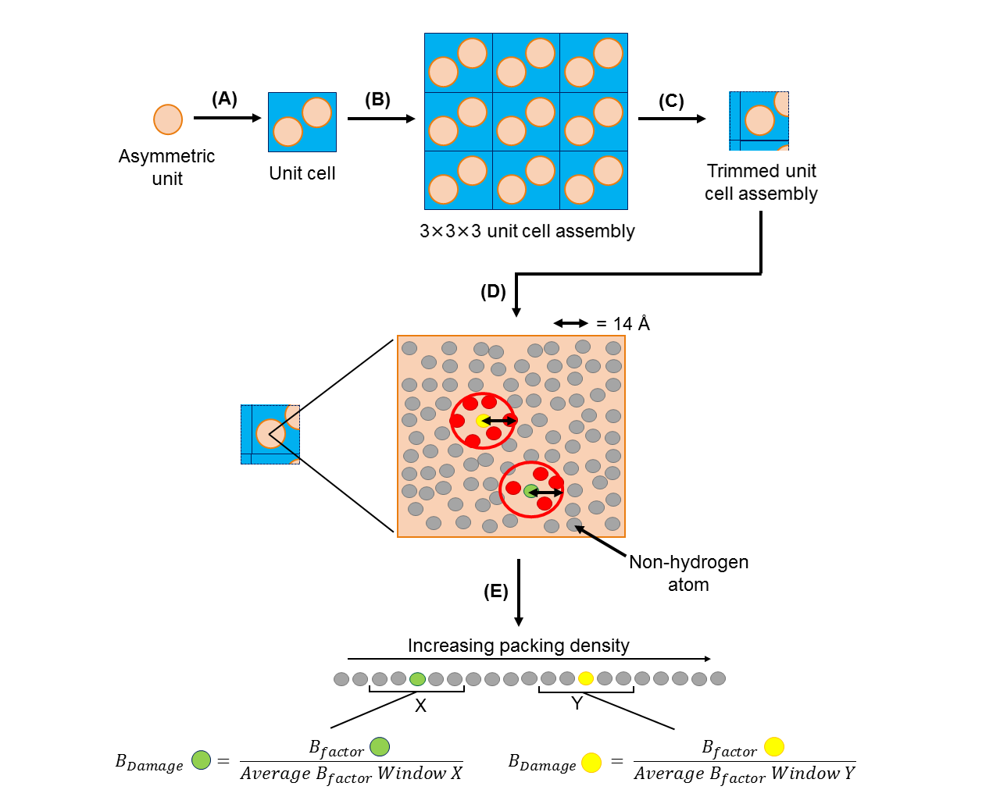
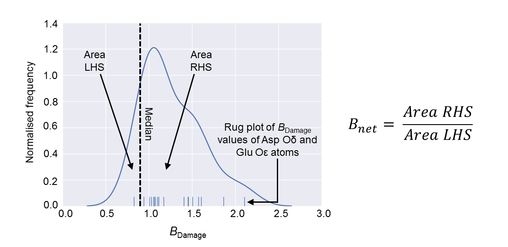

# RABDAM – identifying specific radiation damage in MX structures

[](https://www.python.org/download/releases/2.7/)
[](https://www.python.org/download/releases/3.6/)
[](https://github.com/GarmanGroup/RABDAM/blob/master/COPYING.LESSER)

A program to calculate the *B*<sub>Damage</sub> and *B*<sub>net</sub> metrics to quantify the extent of specific radiation damage present within an individual MX structure. Suitable for running on any standard format PDB or mmCif file.

\*\***NOTE:** These scripts are under development, and are updated regularly. The program is currently being extended to incorporate nucleic acids analysis. Whilst these new capabilities are being tested, presently RABDAM is restricted to assessing damage to (i) protein crystal structures and (ii) the protein component of protein / nucleic acid crystal structures. If in the meantime you would like to use RABDAM for nucleic acids analysis, please contact the authors at the email address provided at the bottom of the page.\*\*

___

## Contents
-	[How to run in brief](#how-to-run-in-brief)
- [Background](#background)
-	[Usage](#usage)
    - [Installation](#installation)
    -	[System requirements](#system-requirements)
    - [Data requirements](#data-requirements)
    -	[Running RABDAM](#running-rabdam)
    -	[Writing the RABDAM input file](#writing-the-rabdam-input-file)
-	[Queries](#queries)
-	[Contributors](#contributors)
-	[Citing RABDAM](#citing-rabdam)

___

## How to run in brief
RABDAM is a command line program. To run the program with its recommended default parameter values, execute:

`python rabdam.py –f XXXX`

, where XXXX is the 4 character PDB accession code of the MX structure under study. Alternatively, you can provide RABDAM with an absolute file path to a locally saved PDB file:

`python rabdam.py –f path/to/pdb_file.pdb`

, or to a locally saved mmCif file:

`python rabdam.py –f path/to/mmcif_file.cif`

See the “*Usage*” section below for further details.

___

## Background
During macromolecular crystallography (MX) data collection, X-rays are also absorbed by and deposit energy within the crystal under study, causing damage. This damage can result in localised chemical changes to the crystalline macromolecule copies, for example to disulfide bond cleavage in proteins, *etc*. Such *specific radiation damage* manifestations can lead to incorrect biological conclusions being drawn from an MX structure if they are not identified and accounted for. Unfortunately, the high intensities of third generation synchrotron sources have resulted in specific radiation damage artefacts commonly being present in MX structures deposited in the Protein Data Bank (PDB), even when data collection is carried out at 100 K.

The chemical changes induced by specific radiation damage cause an accompanying increase in the atomic *B*-factor values of affected sites. However, multiple factors can affect an atom’s *B*-factor value in addition to radiation damage, the most important of these being its mobility. The increase in atomic *B*-factor (from herein referred to as *B*-factor) caused by specific radiation damage is insufficiently large to distinguish damage from mobility.

There is a strong positive correlation between the mobility of an atom within a crystal structure and its packing density, *i.e.* the number of atoms present in its local environment. The *B*<sub>Damage</sub> metric is full isotropic atomic *B*-factor corrected for packing density: specifically, the *B*<sub>Damage</sub> value of an atom *j* is equal to the ratio of its *B*-factor to the average *B*-factor of atoms 1 to *n* which occupy a similar packing density environment to atom *j*. The *B*<sub>Damage</sub> metric has been shown to identify expected sites of specific radiation damage in damaged MX structures (Gerstel *et al.*, 2015).


The method of calculating an atom’s *B*<sub>Damage</sub> value is summarised in the diagram below:

___


Calculation of the *B*<sub>Damage</sub> metric. From an input PDB / mmCif file of the asymmetric unit of a macromolecule of interest, RABDAM **(A)** generates a copy of the unit cell, followed by **(B)** a 3x3x3 assembly of unit cells. **(C)** Atoms in the 3x3x3 unit cell assembly that lie further than 7 Å from the asymmetric unit are discounted. **(D)** The packing density of an atom *j* in the asymmetric unit is calculated as the number of atoms within a 7 Å radius. **(E)** Asymmetric unit atoms are ordered by packing density; the *B*<sub>Damage</sub> value of atom *j* is then calculated as the ratio of its *B*-factor to the average of the *B*-factor values of atoms grouped, via a sliding window, as occupying a similar packing density environment. Note that hydrogen atoms are not considered in the calculation of *B*<sub>Damage</sub>. Diagrams are shown in 2D rather than 3D for clarity.

___

*B*<sub>Damage</sub> values are calculated from full atomic isotropic *B*-factor values, which should be listed in the *B*-factor field of a structure’s ATOM / HETATM records in a standard format PDB / mmCif file. However, ~10% of PDB / mmCif files list alternative *B*-factor values in this field (Touw & Vriend, 2014). The *B*-factor Databank (BDB) contains PDB files with full isotropic (\*but not necessarily atomic) *B*-factor values in the ATOM / HETATM record *B*-factor field; all PDB entries with sufficient header information to determine the content of and if necessary re-calculate the *B*-factor field are incorporated in the BDB (Touw & Vriend, 2014). RABDAM incorporates a regularly updated list of accession codes of PDB structures deposited with full isotropic *B*-factors that has been downloaded from the BDB; the program will flag a warning if the user specifies an accession code that is not on this list for RABDAM analysis.

The *B*<sub>net</sub> metric is a derivative of the (per-atom) *B*<sub>Damage</sub> metric that summarises in a single value the total extent of specific radiation damage suffered by an MX structure. One of the best-characterised chemical changes resulting from specific radiation damage that occurs within proteins\* is the decarboxylation of Glu and Asp residues; the *B*<sub>net</sub> metric is calculated from a kernel density estimate of the *B*<sub>Damage</sub> values of a structure’s Glu and Asp side chain oxygen atoms as the ratio of the area under the curve either side of the median of the (overall) *B*<sub>Damage</sub> distribution.

(\* An equivalent of this protein-specific *B*<sub>net</sub> metric for nucleic acids is currently being developed - see the program description above.)

The method of calculating the *B*<sub>net</sub> value for a protein structure is summarised in the diagram below:

___


The *B*<sub>net</sub> metric is calculated as the ratio of the area either side of the median (of the overall *B*<sub>Damage</sub> distribution) underneath a kernel density estimate of the *B*<sub>Damage</sub> values of the terminal oxygen atoms of Glu and Asp residues.

___

RABDAM will calculate the values of the *B*<sub>Damage</sub> and *B*<sub>net</sub> metrics for any standard format PDB or mmCif file to identify potential individual sites, plus the total extent, of specific radiation damage within the structure.

___

## Usage
#### Installation
1. RABDAM can be downloaded / cloned from GitHub. You can then either run RABDAM as a script from the RABDAM directory, or alternatively you can install RABDAM as a package (which can be run from any directory) by navigating to the RABDAM directory and executing:<br>
`python setup.py install`<br>

2. RABDAM can be installed (as a package) straight from [PyPi](https://pypi.python.org/pypi/rabdam) with `pip`:<br>
`pip install rabdam`<br>

3. RABDAM will also shortly be available as part of the [CCP4 software suite](http://www.ccp4.ac.uk/).

___

#### System requirements
RABDAM supports both Python 2 and Python 3. In addition, it is dependent upon the following packages / programs that are not included in the [Anaconda Python distribution](https://www.continuum.io/downloads) (release 4.3.0 onwards):

-	The [CCP4 software suite](http://www.ccp4.ac.uk/) (RABDAM has a dependency on the CCP4 suite program PDBCUR)

To check whether your computer is missing any of the packages / programs required to run RABDAM, execute:

`python rabdam.py --dependencies`

\*\***NOTE:** Owing to its PDBCUR dependence, RABDAM can only be run in a terminal / command prompt in which CCP4 programs can also be run (*e.g.* the CCP4 console).\*\*

RABDAM will take approximately 1 min to run a 200 kDa structure on a single processor (as estimated from tests performed under Windows 7 on a 3.70 GHz Intel i3-4170 processor). It is compatible with Windows, Mac and Linux operating systems.

___

#### Data requirements
RABDAM can be run on any standard format PDB or mmCif file of a single model of your MX structure of interest (specifically, it requires the CRYST1 line from the header information, as well as the ATOM / HETATM records). Note however that because *B*<sub>Damage</sub> is a per-atom metric, it should only be calculated for structures for which *B*-factor values have been refined per-atom. Furthermore, owing to the correlation between *B*-factor and occupancy values, the only non-ligand atoms subject to occupancy refinement should be those in alternate conformers (whose occupancy should sum to 1).

____

#### Running RABDAM
\*\*RABDAM can be run either as a script or as a package (see the [Installation](#installation) section for further details). The example commands provided below are for running the program as a script. If you are running RABDAM as a package, simply replace `python rabdam.py` with `rabdam`.\*\*

RABDAM is a command line program. There are four main command line flags that control the program run:

-	`-i` / `--input`
-	`-f` / `--pdb_file`
-	`-r` / `--run`
-	`-o` / `--output`

<br></br>
The `-i` and `-f` flags control the input to the program. One of these two mutually exclusive flags is required for RABDAM to run.

The `-i` flag is used to specify the name of the input txt file that lists your selected program parameter values (see the "*Constructing an input file*" section below for details of what this input file should include). If the input file is located in the same directory as the rabdam.py script, you only need provide the file name to run RABDAM:

`python rabdam.py -i input_file.txt`

Otherwise however you will need to provide its absolute file path:

`python rabdam.py -i path/to/input_file.txt`

Alternatively, if you wish to perform a run of RABDAM using entirely default parameter values, it is possible to run RABDAM without an input file; in this case the `-f` flag is used to provide RABDAM with either a 4 character PDB accession code (XXXX), or an absolute file path (path/to/pdb_file.pdb or path/to/mmcif_file.cif), of the MX structure to be analysed:

`python rabdam.py -f XXXX` / `python rabdam.py -f path/to/pdb_file.pdb` / `python rabdam.py -f path/to/mmcif_file.cif`

It is possible to specify more than one PDB and / or mmCif files for analysis following the `-f` flag, *e.g.*:

`python rabdam.py –f path/to/pdb_file_1.pdb path/to/mmcif_file_2.cif path/to/pdb_file_3.pdb`

Importantly, note that when using the `-f` flag, the supplied file path(s) must not contain any spaces. (This restriction does not apply when specifying file path(s) within an input txt file however.)

<br></br>
The `-r` and `-o` flags control the output from the program. Both of these flags are optional.

The `-r` flag can be used to instruct RABDAM to run to completion (default), or to stop / start part way through its full run. RABDAM is structured such that it writes the *B*<sub>Damage</sub> values calculated for an input MX structure to a dataframe; this dataframe is then used to write the program output files. Through use of the `-r` flag it is possible to instruct RABDAM to stop (`-r df` / `-r dataframe`) or start (`-r analysis`) its run following dataframe construction. This option will save time if for example you wish to change the formatting of the program output files (which can be controlled using parameters specified in the input txt file - see the “*Constructing an input file*” section below) without changing the *B*<sub>Damage</sub> distribution itself.

The `-o` flag can be used to control the selection of output files that the program writes. By default RABDAM writes 6 output files, specified by the following 5 keywords:

- `kde` : a kernel density estimate of the distribution of *B*<sub>Damage</sub> values calculated for the input MX structure
- `bdam` : a PDB file in which the *B*-factor column of the ATOM (/ HETATM) records is replaced by ln(*B*<sub>Damage</sub>) values (thus allowing the structure to be uniformly coloured by *B*<sub>Damage</sub> using molecular graphics software such as PyMol, CCP4mg, *etc*), plus an mmCif file in which a column of *B*<sub>Damage</sub> values is appended to the ATOM (/ HETATM) records (located between the *B*-factor and element columns)
- `csv` : a csv file listing the properties (both those in the input PDB / mmCif file and those calculated by RABDAM) of all atoms in the input MX structure included in the *B*<sub>Damage</sub> analysis
- `bnet` : a kernel density estimate of the *B*<sub>Damage</sub> values of the terminal oxygen atoms of Glu and Asp residues, plus the value of the (protein-specific) *B*<sub>net</sub> value calculated from this distribution (see the “*Background*” section)
- `summary` : an html file summarising the results presented in the above 5 output files

It is possible to control which of these output files RABDAM writes using the `-o` flag plus the keyword names of the output files (which are highlighted in the list above), listed in any order. For example, to obtain the csv and *B*<sub>net</sub> output files, execute:

`python rabdam.py –o csv bnet` (/ `python rabdam.py -o bnet csv`)

Note that if you direct RABDAM to write the summary html file (`python rabdam.py -o summary`) then RABDAM will also write the kde and bnet files. This is because in order for the summary html file to be able to display these graphs, the graphs need to be saved to the local machine.

<br></br>
In addition, there are two supplementary command line flags:

- `-h` / `--help`
- `--dependencies`

The `-h` flag displays a help message in the terminal / command prompt listing the different command line flags that can / must be specified when running RABDAM. The `--dependencies` flag directs the program to test whether the system it is being run on has the necessary programs / Python packages installed for RABDAM to run to completion.

___

#### Writing the RABDAM input file
If you wish to run RABDAM with non-default parameter values, you will need to provide the program with an input file specifying your selected parameter values. RABDAM takes (in any order) 16 input parameters (stipulated by the italicised keywords):

- The name of the PDB / mmCif file(s) to be analysed

Either a 4 character PDB accession code, or an absolute file path (which may contain spaces). It is possible to run multiple structures from a single input file by listing the names of each of those structures separated by commas (see below). This is the only parameter not stipulated by a keyword, and which does not have a default value.

-	The output directory, *dir*

The location of the directory (specified by its absolute file path) in which you would like the program output files to be written. If not specified, this defaults to the current working directory.

- Option to ignore errors encountered during batch runs, *batchContinue*

Directs the program, if it encounters a recognised program error during a batch run, to either skip to the next structure in the list ("*True*") or to terminate ("*False*", default behaviour).

- Option to overwrite pre-existing files with the same name as the new output files, *overwrite*

Directs the program, if it encounters files of the same name as the output files it is going to write already present in the output directory, to always overwrite these pre-existing files ("*True*"), or to ask the user for a decision for each case encountered ("*False*", default behaviour).

-	The packing density threshold, *PDT*

The packing density of an atom is calculated as the number of atoms within a sphere of radius *PDT* Å. Its default value is 7, but it is possible to set it equal to any value (measured in Å). **Do not change the value of this parameter unless you know what you are doing!**

- The sliding window size, *windowSize*

The size (as a percentage of the total number of atoms included in the *B*<sub>Damage</sub> analysis) of the sliding window used to group atoms in a similar packing density environment for *B*<sub>Damage</sub> calculation. Its default value is 0.02 (2%), however it can take any value ≤ 1 (100%). **Do not change the value of this parameter unless you know what you are doing!**

-	Option to remove HETATM, *HETATM*

Specifies whether you want to include (“*Keep*”) / exclude (“*Remove*”) HETATM in / from the *B*<sub>Damage</sub> calculation. Owing to the difference in the *B*-factor to packing density ratios of HETATM as compared to ATOM, by default this parameter is set to “*Remove*”. **Do not change the value of this parameter unless you know what you are doing!**

-	Option to retain only protein / nucleic acid atoms, *proteinOrNucleicAcid*

Specifies whether to include protein atoms (“*Protein*”) or nucleic acid atoms (“*Nucleic Acid*” / “*NA*”) in the *B*<sub>Damage</sub> calculation. Owing to the difference in the *B*<sub>factor</sub> to packing density ratios of these two ATOM types, it is highly recommended that they are analysed separately. By default this parameter is set to “*Protein*”. **Currently whilst the program is under development to incorporate nucleic acids analysis this parameter cannot be altered from its default value.**

-	Option to remove atoms from the *B*<sub>Damage</sub> calculation, *removeAtoms*

Allows the removal of individual atoms (specified either by their atom serial number or by their residue type) from the *B*<sub>Damage</sub> calculation (by default no atoms are removed using this parameter). For convenience when writing the input file, it is possible to specify multiple atoms at once (see the guidelines below for providing multiple values for the same parameter). This parameter is useful to allow removal of atoms with anomalously high / low *B*-factors, as for example occurs when amino acid side chains are modelled in the absence of electron density. **Do not change the value of this parameter unless you know what you are doing!**

-	Option to add atoms in to the *B*<sub>Damage</sub> calculation, *addAtoms*

Allows the addition of individual atoms (specified either by their atom serial number or by their residue type) to the *B*<sub>Damage</sub> calculation (by default no atoms are added using this parameter). (Note however that the same atom cannot be considered more than once in the *B*<sub>Damage</sub> calculation.) For convenience when writing the input file, it is possible to specify multiple atoms at once (see the guidelines below for providing multiple values for the same parameter). **Do not change the value of this parameter unless you know what you are doing!**

-	Option to highlight atoms on the kernel density estimate of the *B*<sub>Damage</sub> distribution, *highlightAtoms*

Highlights the *B*<sub>Damage</sub> values of specified atoms on the output kernel density estimate (by default no atoms are highlighted). Atoms are specified by their serial numbers as listed in the input PDB / mmCif file provided to RABDAM. It is possible to highlight multiple atoms at once (see the guidelines below for providing multiple values for the same parameter); note however that it is recommended no more than 6 atoms are specified at once (beyond 6 atoms the graph colour scheme will repeat itself, furthermore the complete key might not fit onto the plot).

-	Option to create a copy of the initial PDB file, *createOrigpdb*

Writes a copy of the initial PDB file (which is either provided to the program directly, or is obtained via conversion of the input mmCif file) to the output directory when set to "*True*" (by default this parameter is set to "*False*").

-	Option to create a PDB file of the filtered asymmetric unit, *createAUpdb*

Writes a PDB file of the filtered (to remove hydrogen atoms, 0 occupancy atoms and alternate conformers) asymmetric unit coordinates to the output directory when set to "*True*" (by default this parameter is set to "*False*").

-	Option to create a PDB file of the unit cell, *createUCpdb*

Writes a PDB file of the unit cell coordinates to the output directory when set to "*True*" (by default this parameter is set to "*False*").

-	Option to create a PDB file of the 3x3x3 unit cell assembly, *createAUCpdb*

Writes a PDB file of the 3x3x3 unit cell assembly coordinates to the output directory when set to "*True*" (by default this parameter is set to "*False*").

-	Option to create a PDB file of the trimmed unit cell assembly, *createTApdb*

Writes a PDB file of the trimmed 3x3x3 unit cell assembly coordinates to the output directory when set to "*True*" (by default this parameter is set to "*False*").

**Note that if a parameter is not specified in the input file, it will take its default value in the RABDAM run.**

<br></br>
In order for RABDAM to successfully parse in an input file, it must comply with the following formatting guidelines:

-	Keywords and their associated values must be separated by “=”. Successive keyword / value pairs must be separated by “,”.
-	Multiple values for the same keyword must be separated by “;”. Alternatively, it is possible to specify a range of consecutive (numerical) values by providing the minimum and maximum values of the range separated by “-”. So, you could direct RABDAM to highlight atoms 2, 3 and 4 on the output *B*<sub>Damage</sub> kernel density estimate via either *highlightAtoms=2;3;4* or *highlightAtoms=2-4*.

Below is an example input file instructing RABDAM to analyse the RNase structures 2BLP and 2BLZ, writing the output files to the directory C:\Users\UserName\Documents\RABDAM_test_output, and highlighting atoms 14, 15, 16 and 30 on the output *B*<sub>Damage</sub> kernel density estimate. All other parameters are set to their default values. This example input file ("*example_input.txt*") is provided along with the RABDAM Python scripts that can be downloaded from this web page.

```
2BLP, 2BLZ,
dir=C:\Users\UserName\Documents\RABDAM_test_output,
batchContinue=False,
overwrite=False,
PDT=7,
windowSize=0.02,
HETATM=Remove,
proteinOrNucleicAcid=Protein,
addAtoms=,
removeAtoms=,
highlightAtoms=14-16;30,
createOrigpdb=False,
createAUpdb=False,
createUCpdb=False,
createAUCpdb=False,
createTApdb=False
```

___

## Queries
Please email kathryn.l.shelley@gmail.com.

___

## Contributors
- Kathryn Shelley
- Tom Dixon
- Jonny Brooks-Bartlett

This software was developed in the lab of Professor Elspeth Garman at the University of Oxford.

___

## Citing RABDAM
The initial development and testing of the *B*<sub>Damage</sub> metric is described in:

- Gerstel M, Deane CM, Garman EF (2015) Identifying and quantifying radiation damage at the atomic level. *J Synchrotron Radiat* **22**: 201-212. [http://dx.doi.org/doi:10.1107/S1600577515002131](http://dx.doi.org/doi:10.1107/S1600577515002131)

Please cite this paper if you use RABDAM to analyse specific radiation damage in your MX structure.

<br></br>
RABDAM is dependent upon the CCP4 suite program PDBCUR:

- Winn MD, Ballard CC, Cowtan KD, Dodson EJ, Emsley P, Evans PR, Keegan RM, Krissinel EB, Leslie AGW, McCoy A, McNicholas SJ, Murshudov GN, Pannu NS, Potterton EA, Powell HR, Read RJ, Vagin A, Wilson KS (2011) Overview of the CCP4 suite and current developments. *Acta Crystallogr D* **67**: 235-242
[https://doi.org/doi:10.1107/S0907444910045749](https://doi.org/doi:10.1107/S0907444910045749)

<br></br>
RABDAM extracts a list of PDB accession codes with full isotropic (\*but not necessarily atomic) *B*-factors from the *B*-factor Databank:
- Touw WG, Vriend G (2014) BDB: Databank of PDB files with consistent *B*-factors. *Protein Eng Des Sel* **27**: 457-462
[https://doi.org/10.1093/protein/gzu044](https://doi.org/10.1093/protein/gzu044)

See also [https://github.com/cmbi/bdb](https://github.com/cmbi/bdb).
