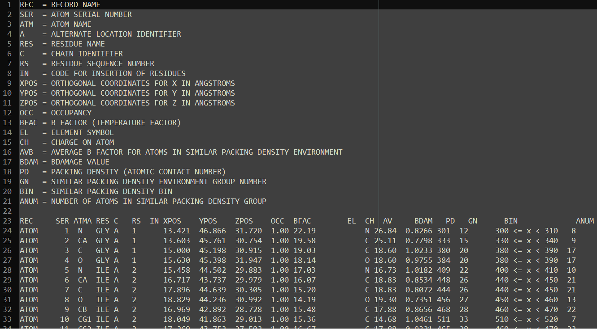
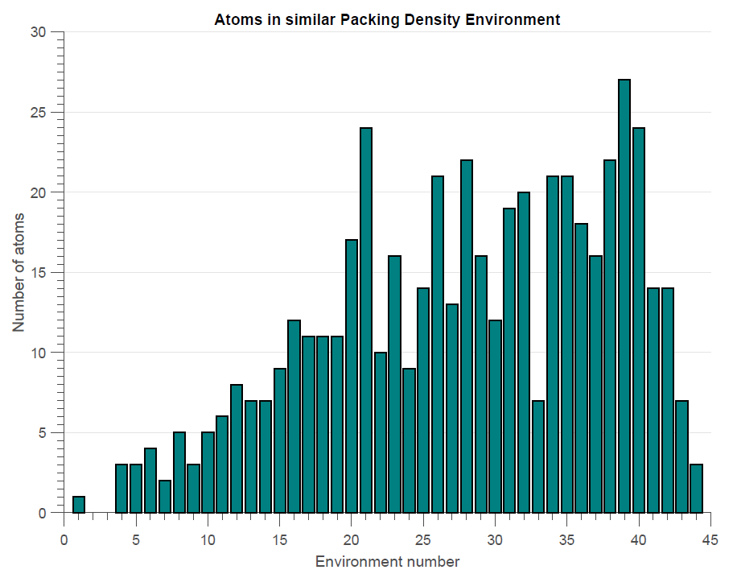

# B_Damage
A program use to calculate B_Damage values for a biomolecular structure whose atomic coordinates are stored in PDB format.

**NOTE: The program is currently written in MATLAB but a version written in Python is currently under development.**

## Introduction
For molecular structures determined using X-ray crystallography each atom in the structure is assigned an ***atomic B factor*** value. This value effectively represents our level of uncertainty about the allocated position of that atom. The most mobile atoms will have the highest B factor values. However an atom's mobility could be due to different factors: increased thermal motion due to absorbed energy from the incident X-ray photons (a sign of *radiation damage*), or it could simply be due to the atom being in a highly flexible region of the protein and it is not surrounded by other 'stationary' atoms. ***B_Damage*** is a metric that attempts to deconvolute these factors to give an "effective" B factor value that is just a measure of the damage.   

**B_Damage** for a given atom is the ratio of the atom's B factor and the average B factor of atoms within a *similar packing density*. Atoms are grouped into **Similar packing density** environments, meaning that atoms in that group have a similar surrounding atomic environment which can be defined in several ways. The default here is that atoms with similar packing densities have a similar number of atoms within a given radius of the atom.

## Usage
**NOTE: This currently only refers to the version written in MATLAB. We'll update this when the Python version is complete.**   
Currently there are no binaries to download for the B_damage program so you'll have to download the source code to run it if you have the correct interpreter downloaded. The current version of the program has been tested on MATLAB 2014b and MATLAB 2015b but should work on other recent versions of [MATLAB](http://uk.mathworks.com/products/matlab/?refresh=true). MATLAB is also mostly compatible with [GNU Octave](https://www.gnu.org/software/octave/) so although it hasn't been tested with Octave, you may find it works with it too.   

- Assuming you have the correct interpreter downloaded you should download the source *B_Damage* code (scroll to the top of the page and on the right click on *"Download ZIP"*) and extract the contents to a directory of your choice.
- Open a command window/terminal and change directory to the MATLAB code. It should be somewhere like `path/to/your/directory/B_Damage-master/CalculateBdamage`.
- Once in the directory you can calculate B damage values for a structure with the command `matlab -r "CalculateBdamage('pdb code')"` where `pdb code` is the 4 letter code for the structure that you wish to calculate B damage for.

So for example if you wanted to calculate the B damage values for the 2BN3 insulin dataset you would write `matlab -r "CalculateBdamage('2bn3')`.   
If you wanted to calculate the B damage values from a PDB that you have in a local repository (regardlessof whether it has been deposited to the PDB or not) then you need to enter the path to the file. So for example if you had the PDB file for the insulin dataset then you can calculate the B damage values using the command `matlab -r "CalculateBdamage('path/to/PDB/file/2bn3.pdb')`.

## Program Output
The most important output from the program is the text file that is produced from the program: 
These data are produced from a run of the program with the PDB structure "2BN3". The data for each atom is stored in a similar manner as it is in a PDB file (in rows) and each column is defined at the top of the file. The column titled **BDAM** contains the B Damage value for each atom.   

The program also outputs a histogram showing the numbers of atoms that are in a similar packing density environment. The *environment number* on the x-axis of the histogram corresponds to the group number (column labelled **GN** in the image from the text file above) and *NOT* the number of atoms that surround the atom.

## Contributors
- Thomas Dixon
- Jonathan Brooks-Bartlett    

**Please cite** M. Gerstel, C. M. Deane and E.F. Garman. (2015). J. Synchrotron Radiation. **22**, 201-212 [http://dx.doi.org/doi:10.1107/S1600577515002131](http://dx.doi.org/doi:10.1107/S1600577515002131)
